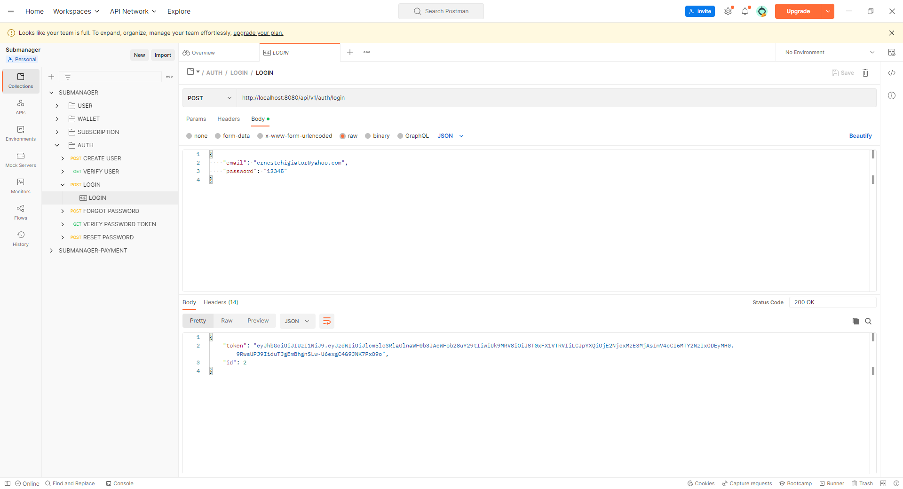
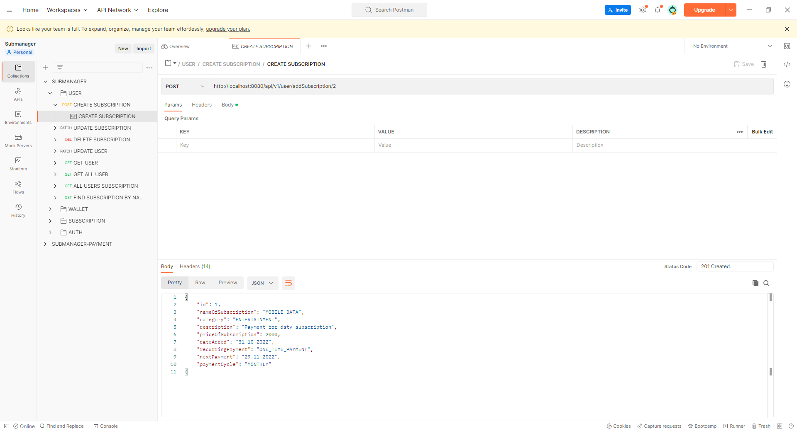

# SUBMANAGER
A subscription management platform to help users manage multiple subscription all in one place. It was created using spring-boot using Maven as dependency tool and MySql as database.

# POST-MAN DOCUMENTATION
https://documenter.getpostman.com/view/21596187/2s8YRjoD34

# TO RUN PROJECT
$ mvn spring-boot:run

# TO RUN TEST
$ mvn test

# CONFIGURATIONS
Open the application.properties file and set your own configurations for the MySql database connection.

